# Exercices UML - Enonces et Corrections

**Projet d'analyse et conception**  
**Recueil des exercices faits en classe**

---

## Table des matieres

| Numero | Titre de l'exercice | Lien |
|---:|---|---|
| 1 | Gestion des locations de velos | [Voir l'exercice](#exercice-1---gestion-des-locations-de-velos) |
| 2 | Gestion des reservations de vols | [Voir l'exercice](#exercice-2---gestion-des-reservations-de-vols) |
| 3 | Gestion d'un DAB | [Voir l'exercice](#exercice-3---gestion-dun-dab) |
| 4 | Reservation des salles EAFC Mouscron | [Voir l'exercice](#exercice-4---reservation-des-salles-eafc-mouscron) |
| 5 | Plateforme de video a la demande | [Voir l'exercice](#exercice-5---plateforme-de-video-a-la-demande) |
| 6 | Societe de livraison express connectee | [Voir l'exercice](#exercice-6---societe-de-livraison-express-connectee) |
| 7 | Gestion de location d'hotel | [Voir l'exercice](#exercice-7---gestion-de-location-dhotel) |
| 8 | Gestion d'une bibliotheque | [Voir l'exercice](#exercice-8---gestion-dune-bibliotheque) |
| 9 | Gestion de trajet | [Voir l'exercice](#exercice-9---gestion-de-trajet) |
| 10 | Gestion d'un entrepot de stockage | [Voir l'exercice](#exercice-10---gestion-dun-entrepot-de-stockage) |
| 11 | Retrait au distributeur automatique de billets | [Voir l'exercice](#exercice-11---retrait-au-distributeur-automatique-de-billets) |
| 12 | Magasin de vente de fleurs | [Voir l'exercice](#exercice-12---magasin-de-vente-de-fleurs) |
| 13 | Caisse de supermarche | [Voir l'exercice](#exercice-13---caisse-de-supermarche) |
| 14 | Gestion d'une agence de location immobiliere | [Voir l'exercice](#exercice-14---gestion-dune-agence-de-location-immobiliere) |

---

## Exercice 1 - Gestion des locations de velos

### Enonce

Une agence de location de velos souhaite informatiser la gestion des locations.

Lorsqu'un client se presente a l'accueil, il indique le type de velo qu'il souhaite louer ainsi que la duree de la location.

L'accueil verifie, en fonction du stock disponible, si la location est possible et informe le client de la reponse.

Si la location est possible :

- une facture est editee pour le client ;
- le client paie immediatement ;
- la facture et le paiement sont transmis au service comptable ;
- l'accueil transmet ensuite la demande au gestionnaire du parc ;
- le gestionnaire du parc prepare le velo demande ;
- le velo est mis a disposition du client.

### Diagramme

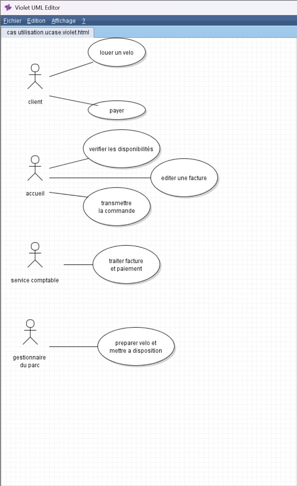

---

## Exercice 2 - Gestion des reservations de vols

### Enonce

On souhaite gerer les reservations de vols effectues dans une agence.

D'apres les interviews realisees avec les membres de l'agence, on sait que :

- les compagnies aeriennes proposent differents vols ;
- un vol est ouvert a la reservation et referme sur ordre de la compagnie ;
- un client peut reserver un ou plusieurs vols, pour des passagers differents ;
- une reservation concerne un seul vol et un seul passager ;
- une reservation peut etre confirmee ou annulee ;
- un vol a un aeroport de depart et un aeroport d'arrivee ;
- un vol a un jour et une heure de depart, et un jour et une heure d'arrivee ;
- un vol peut comporter des escales dans un ou plusieurs aeroport(s) ;
- une escale a une heure de depart et une heure d'arrivee ;
- chaque aeroport dessert une ou plusieurs villes.

### Travail a faire

A partir des elements fournis ci-dessus, elaborer le diagramme de classes en ajoutant tout attribut juge pertinent et qui n'a pas ete decrit dans l'enonce.

### Diagramme

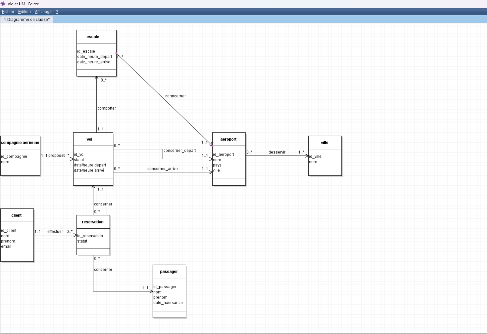

---

## Exercice 3 - Gestion d'un DAB

### Enonce

On considere le systeme suivant de gestion d'un DAB, c'est-a-dire un distributeur automatique de billets.

Le distributeur delivre de l'argent a tout porteur de carte :

- carte Visa ;
- carte de la banque.

Pour les clients de la banque, le distributeur permet :

1. la consultation du solde du compte ;
2. le depot d'argent, par cheque ou en numeraire.

Toute transaction est securisee et necessite par consequent une authentification.

Dans le cas ou une carte est avalee par le distributeur, un operateur de maintenance se charge de la recuperer.

C'est la meme personne qui collecte egalement les depots d'argent et qui recharge le distributeur.

### Travail a faire

Modeliser cette situation par un diagramme de cas d'utilisation.

### Diagramme

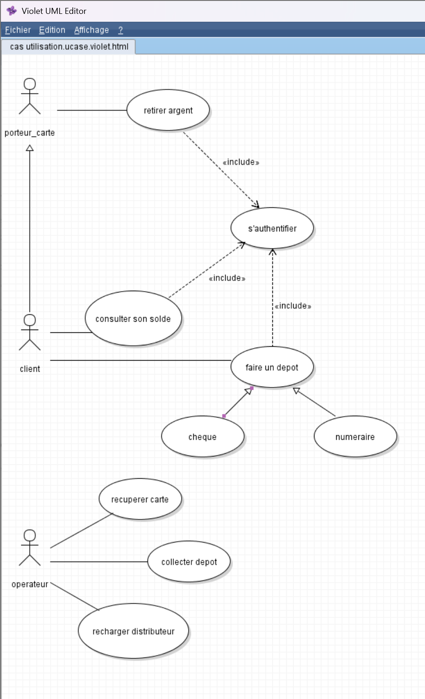

---

## Exercice 4 - Reservation des salles EAFC Mouscron

### Enonce

Dans un etablissement scolaire, on desire gerer la reservation des salles de cours ainsi que du materiel pedagogique :

- ordinateur portable ;
- video projecteur.

Seuls les enseignants sont habilites a effectuer des reservations, sous reserve de disponibilite de la salle ou du materiel.

Le planning des salles peut etre consulte par tout le monde :

- enseignants ;
- etudiants.

Par contre, le recapitulatif horaire par enseignant, calcule a partir du planning des salles, ne peut etre consulte que par les enseignants.

Enfin, il existe pour chaque formation un enseignant responsable qui seul peut editer le recapitulatif horaire pour l'ensemble de la formation.

### Travail a faire

1. Modeliser cette situation par un diagramme de cas d'utilisation.

### Diagramme

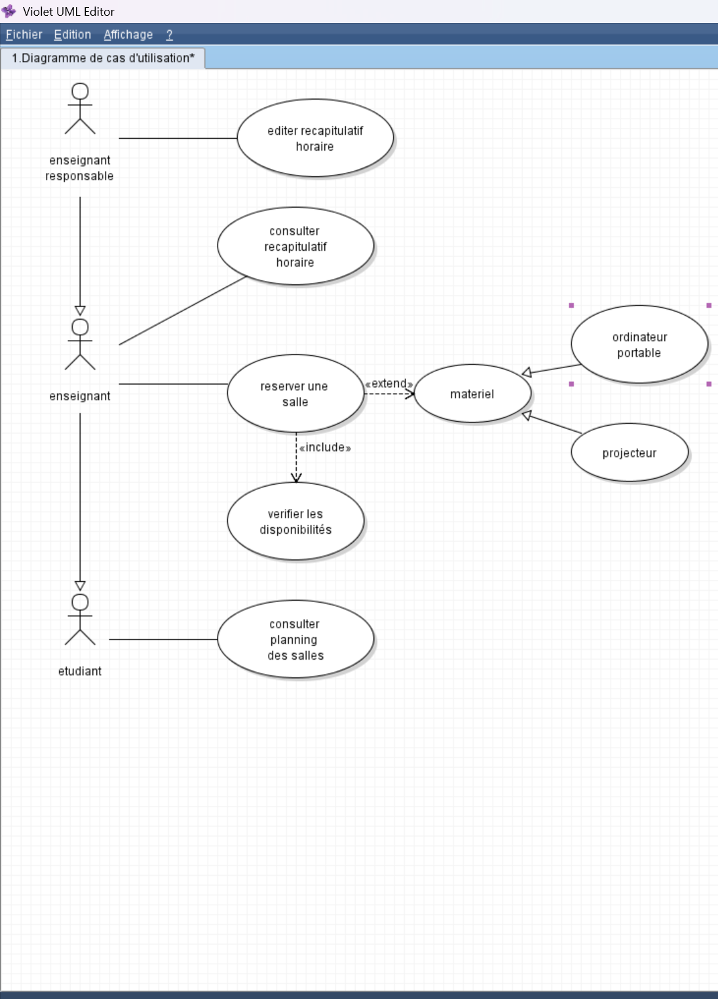

---

## Exercice 5 - Plateforme de video a la demande

### Objectifs

Creer le modele de cas d'utilisation et donner des scenarios.

### Contexte

On remplace le video club et les cassettes par une plateforme de video a la demande.

### Enonce

Une plateforme de video a la demande permet a des utilisateurs de consulter un catalogue de films, documentaires et series.

Les contenus sont fournis par des editeurs ou ayants droit.

La plateforme peut acheter des droits de diffusion pour une duree determinee ou negocier des contrats de mise a disposition avec partage de revenus.

Un visiteur peut consulter une partie du catalogue et creer un compte.

Un client inscrit peut louer un contenu a l'unite pour une duree limitee, par exemple 48 heures. Il peut aussi souscrire un abonnement donnant acces a un ensemble de contenus inclus.

Certains contenus recents restent payants meme pour les abonnes.

Lorsqu'un client loue un contenu, le systeme verifie :

- la disponibilite du contenu ;
- les droits de diffusion ;
- le tarif applicable ;
- le paiement.

Apres validation, le client obtient un droit de lecture temporaire et peut lancer le streaming sur son appareil.

Le gestionnaire de la plateforme administre :

- le catalogue ;
- les tarifs ;
- les abonnements ;
- les contrats avec les editeurs.

Les editeurs fournissent regulierement les metadonnees des contenus et peuvent consulter les statistiques de consultation prevues par contrat.

### Travail a faire

- Donner le diagramme des cas d'utilisation du systeme.
- Penser a utiliser la generalisation d'acteurs.
- Decrire le scenario principal "Louer un contenu a l'unite" par un diagramme de sequence.
- Completer l'analyse des besoins par la description des scenarios principaux des autres cas d'utilisation.

### Diagrammes

#### Diagramme de cas d'utilisation

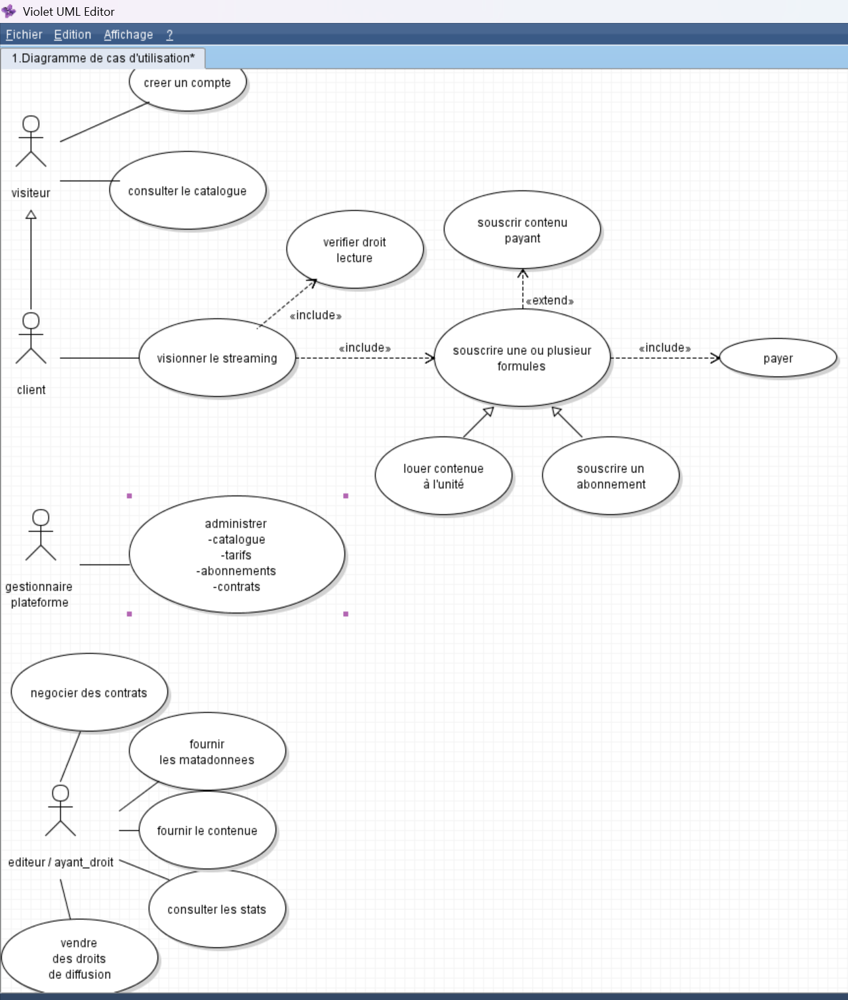

#### Diagramme de sequence

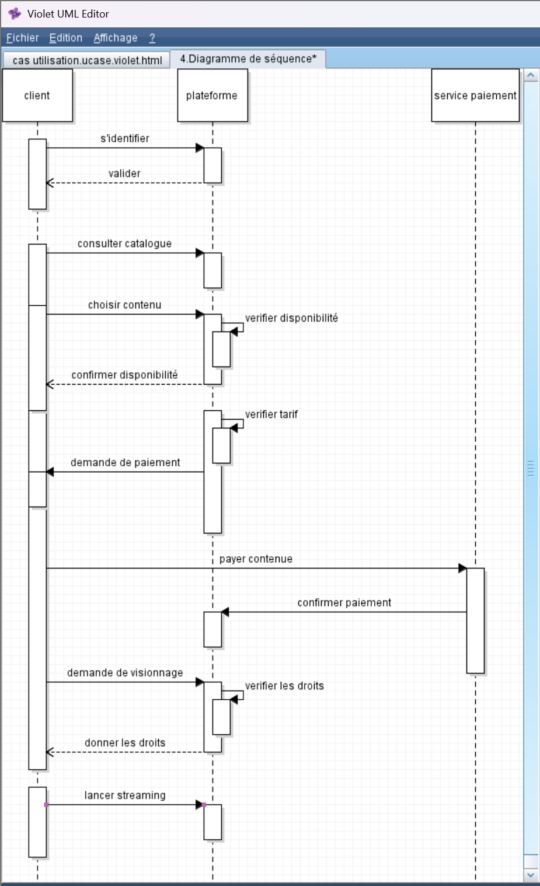

---

## Exercice 6 - Societe de livraison express connectee

### Objectifs

- Modeliser les vues statiques d'un systeme.
- Modeliser les vues dynamiques d'un systeme.
- Produire une documentation claire du projet UML.
- Identifier les acteurs, les cas d'utilisation, les classes et les interactions principales.

### Enonce

On s'interesse a une plateforme de livraison express a domicile utilisee par des particuliers et des entreprises.

Les clients peuvent creer une expedition depuis :

- une agence ;
- un site web ;
- une application mobile.

Le systeme traite deux categories d'envois :

- les envois legers, dont le poids est inferieur ou egal a 2 kg ;
- les colis, dont le poids est superieur a 2 kg.

Le tarif est calcule automatiquement selon :

- le poids ;
- la destination ;
- le niveau de service choisi ;
- l'option d'accuse de reception.

L'option d'accuse de reception ajoute un forfait de 10 euros.

Apres validation, le systeme enregistre :

- les coordonnees de l'expediteur ;
- les coordonnees du destinataire ;
- le poids ;
- la nature du contenu ;
- la valeur declaree.

Le systeme imprime ou envoie par courriel un recepisse au client.

Les expeditions legeres ou a destination de la France sont traitees directement par le service clientele. Apres paiement, le colis est transmis au service logistique pour l'acheminement et le suivi.

Les colis lourds a destination internationale necessitent une declaration douaniere. Le client precise la nature et la valeur du contenu et signe numeriquement les documents.

Ces envois sont transmis au service export. Leur delai est augmente d'au moins 48 heures et leur prix est majore de 10 %.

Les colis de plus de 20 kg ou contenant une marchandise soumise a reglementation doivent obtenir l'accord des douanes.

Le colis ne peut pas etre achemine avant reception du bordereau douanier indiquant les references du colis et le montant de la taxe.

Le service facturation emet alors la facture finale. Apres paiement, le service export transmet le colis et le bordereau au service logistique.

### Travail a faire

- Donner le diagramme des cas d'utilisation.
- Decrire la structure statique par un diagramme de classes.
- Decrire le scenario principal "Gestion d'une expedition nationale ou legere" par un diagramme de sequence.
- Documenter brievement chaque cas d'utilisation.
- Completer l'analyse par les scenarios principaux des autres cas d'utilisation.

### Diagrammes

#### Diagramme de cas d'utilisation

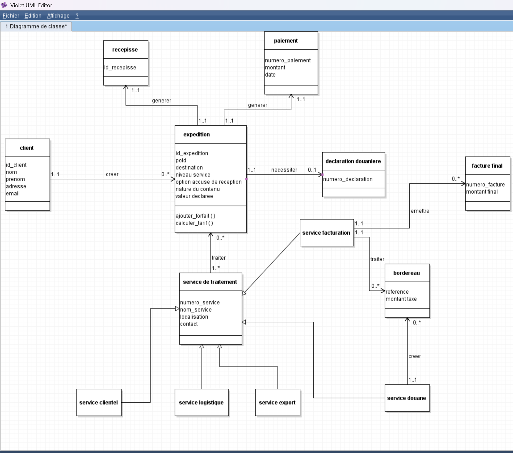

#### Diagramme de classes

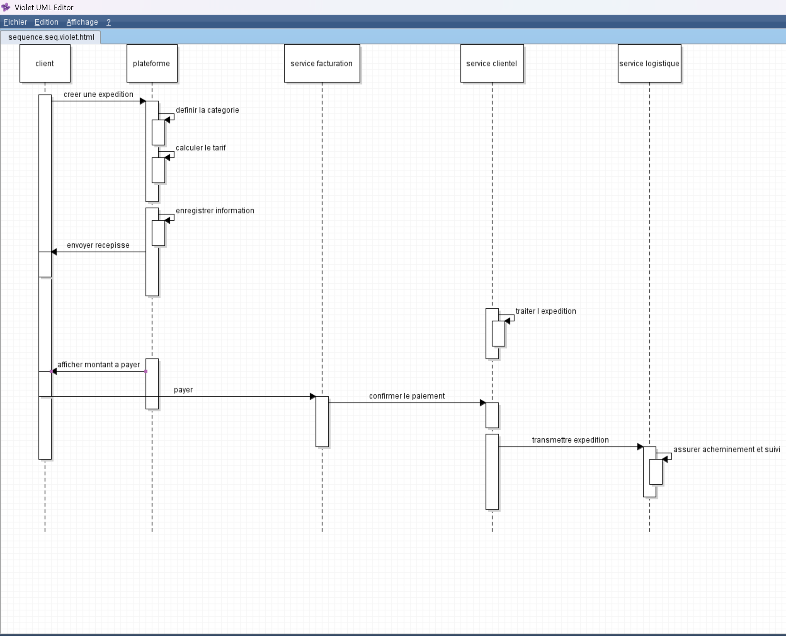

#### Diagramme de sequence

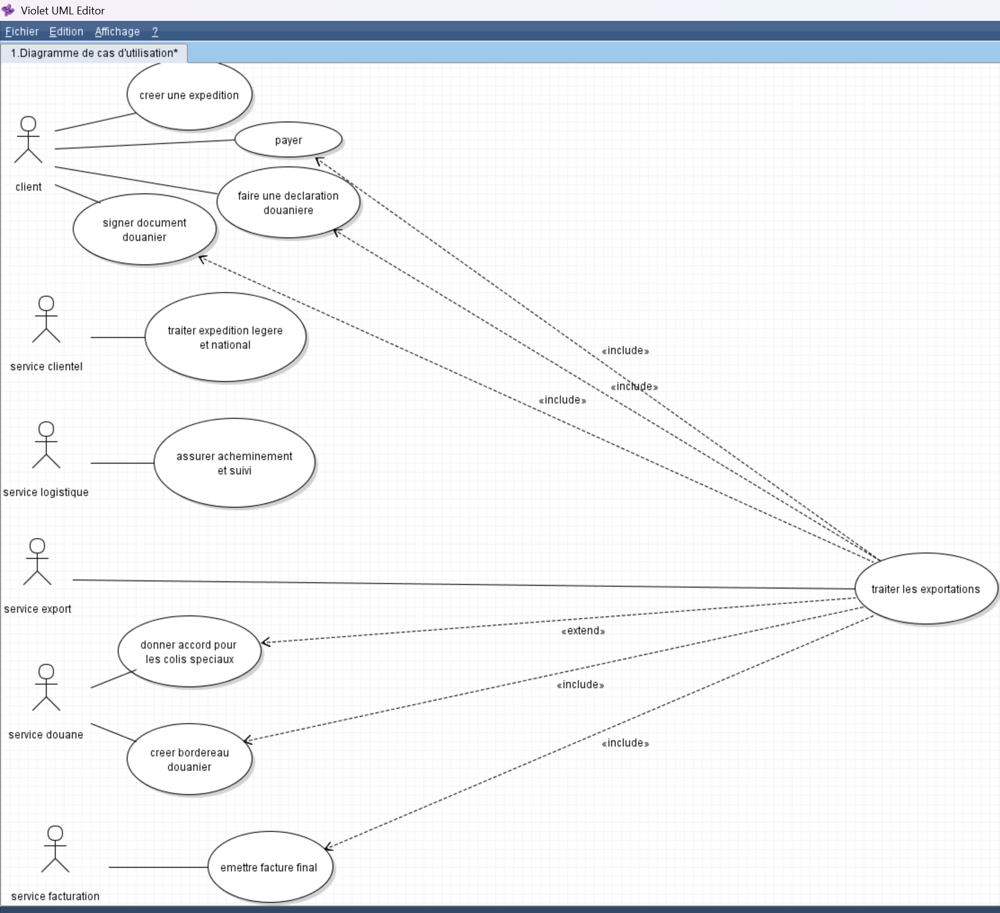

---

## Exercice 7 - Gestion de location d'hotel

### Contexte

Vous etes charge de modeliser un systeme de gestion de location de chambres dans un hotel.

### Description du systeme

Un hotel est compose d'au moins deux chambres.

Chaque chambre dispose d'une salle d'eau equipee soit :

- d'une douche ;
- d'une baignoire.

Ces salles d'eau sont equipees de serviettes propres mises a la disposition des occupants durant leur sejour.

Un hotel heberge des personnes et emploie du personnel, dont un directeur unique charge de la gestion.

Les personnes hebergees peuvent etre des adultes ou des enfants :

- les adultes peuvent louer des chambres, car il faut etre majeur pour louer une chambre ;
- les enfants ne peuvent pas travailler ;
- on connait uniquement le nom, le prenom et l'age des personnes hebergees.

Un hotel possede :

- une adresse ;
- un nombre de pieces ;
- une categorie.

Une chambre est caracterisee par :

- son numero ;
- son nombre de lits ;
- son prix.

Pour la location :

- on veut savoir quel adulte loue quelle chambre ;
- on veut connaitre les dates de debut et de fin de location ;
- pour chaque jour de l'annee, il est necessaire de calculer le loyer de chaque chambre en fonction de son prix et de sa date d'occupation ;
- la somme des loyers permet de calculer le chiffre d'affaires de l'hotel entre deux dates donnees.

### Travail demande

#### Partie 1 - Analyse et modelisation des besoins

**a) Modelisation des classes**

- Identifier les classes necessaires pour representer le systeme.
- Ajouter les attributs et operations pertinentes a chaque classe.
- Definir les relations entre les classes avec leurs multiplicites.

**b) Diagramme UML de classes**

- Representer les classes, leurs attributs, leurs operations, ainsi que leurs relations et multiplicites dans un diagramme UML clair et lisible.

#### Partie 2 - Diagrammes UML

**a) Diagramme de cas d'utilisation**

- Identifier et representer les interactions principales entre les acteurs et le systeme de gestion de l'hotel.

**b) Diagramme de sequence**

- Illustrer le processus complet d'une reservation de chambre par un adulte, en incluant la selection de la chambre, la verification des disponibilites et la confirmation de la location.

### Diagrammes

#### Diagramme de cas d'utilisation

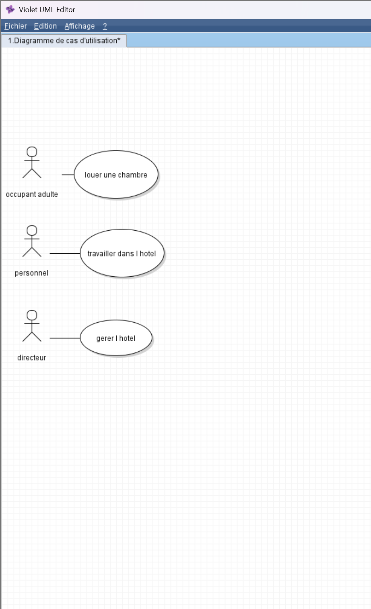

#### Diagramme de classes

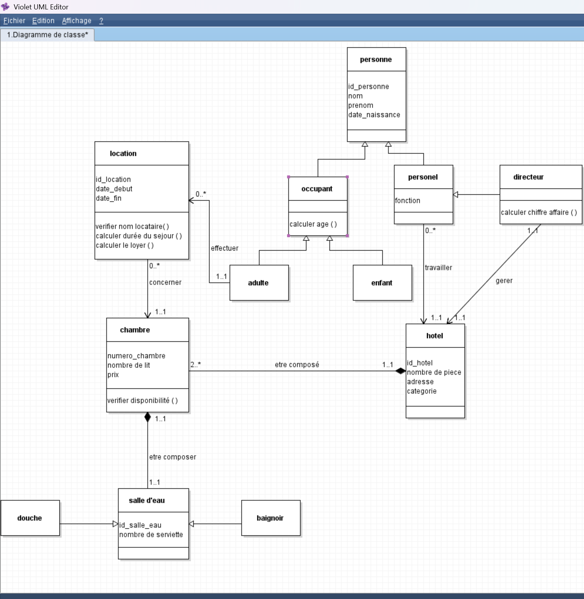

#### Diagramme de sequence

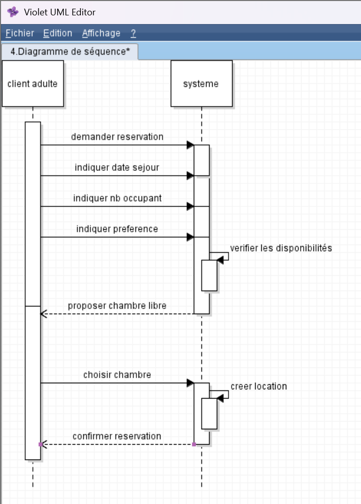

---

## Exercice 8 - Gestion d'une bibliotheque

### Objectif

Modeliser l'emprunt d'un livre par un adherent.

### Scenario principal - Emprunter un livre

1. L'adherent se presente au comptoir avec le livre qu'il souhaite emprunter.
2. La bibliothecaire lance la fonctionnalite "Emprunter un livre" dans l'application.
3. Le systeme verifie :
   - la carte de l'adherent est valide ;
   - le nombre maximal de livres empruntes n'est pas depasse ;
   - il n'y a pas de blocage particulier.
4. Le systeme verifie ensuite si le livre est disponible.
5. Si toutes les conditions sont respectees :
   - un nouveau pret est cree ;
   - la date de pret et la date de retour prevue sont enregistrees ;
   - le pret est associe a l'adherent et au livre ;
   - le livre devient indisponible ;
   - le nombre de livres empruntes par l'adherent est incremente.

> Resultat attendu : un pret valide est cree si l'adherent et le livre sont autorises.

### Travail demande

#### Diagramme de cas d'utilisation

Le diagramme doit montrer :

- les acteurs principaux ;
- le cas d'utilisation "Emprunter un livre" ;
- les cas inclus possibles :
  - verifier adherent ;
  - verifier disponibilite du livre ;
  - creer un pret ;
  - mettre a jour le livre ;
  - mettre a jour l'adherent.

> Penser a bien identifier l'acteur qui declenche le cas d'utilisation.

#### Diagramme de classes

Le diagramme doit contenir les classes principales, par exemple :

- `Adherent` ;
- `Bibliothecaire` ;
- `Livre` ;
- `Pret`.

Pour chaque classe, indiquer des attributs utiles.

Exemples d'attributs :

**Adherent**

- `idAdherent` ;
- `nom` ;
- `carteValide` ;
- `nombreLivresEmpruntes`.

**Livre**

- `idLivre` ;
- `titre` ;
- `auteur` ;
- `disponible`.

**Pret**

- `idPret` ;
- `datePret` ;
- `dateRetourPrevue`.

Ajouter aussi les associations entre les classes avec les multiplicites.

#### Diagramme de sequence

Representer le deroulement du scenario "Emprunter un livre" en montrant au minimum :

- l'adherent ;
- la bibliothecaire ;
- l'application ;
- l'adherent dans le systeme ;
- le livre ;
- le pret.

Le diagramme doit inclure ces etapes :

1. Demande d'emprunt.
2. Saisie de l'emprunt dans l'application.
3. Verification du droit d'emprunt de l'adherent.
4. Verification de la disponibilite du livre.
5. Creation du pret.
6. Mise a jour de l'etat du livre.
7. Mise a jour du nombre de livres empruntes.
8. Confirmation de l'emprunt.

Utiliser un bloc conditionnel `alt` pour representer :

- adherent non autorise ;
- livre non disponible ;
- emprunt accepte.

### Diagrammes

#### Diagramme de cas d'utilisation

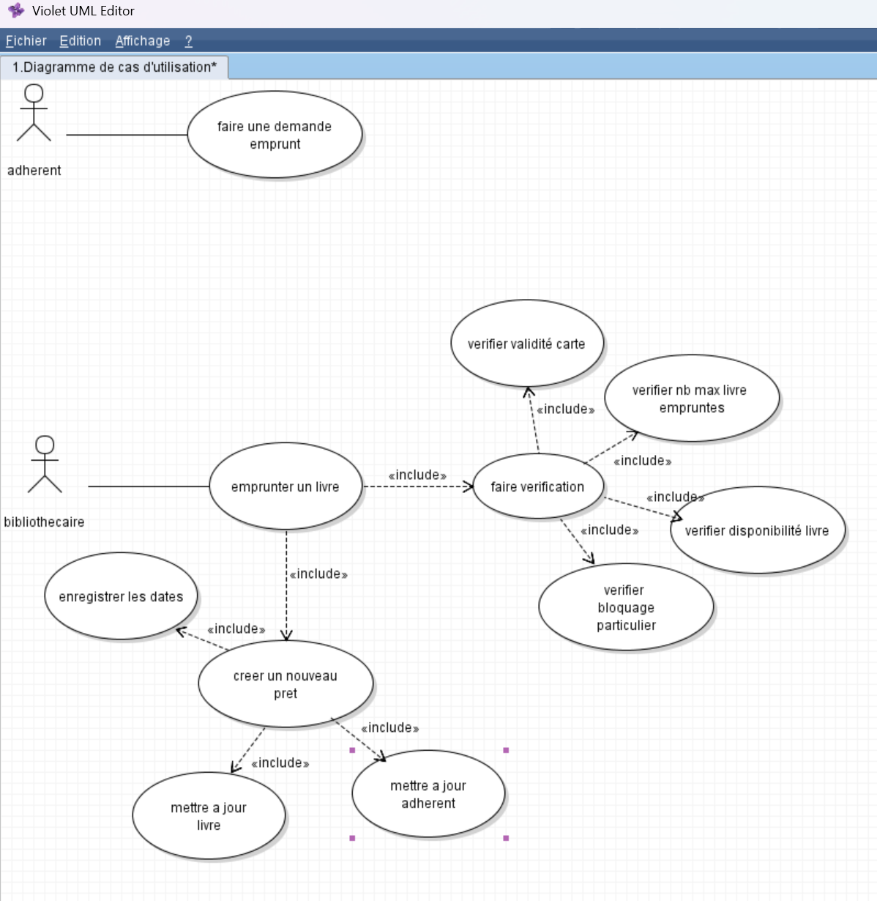

#### Diagramme de classes

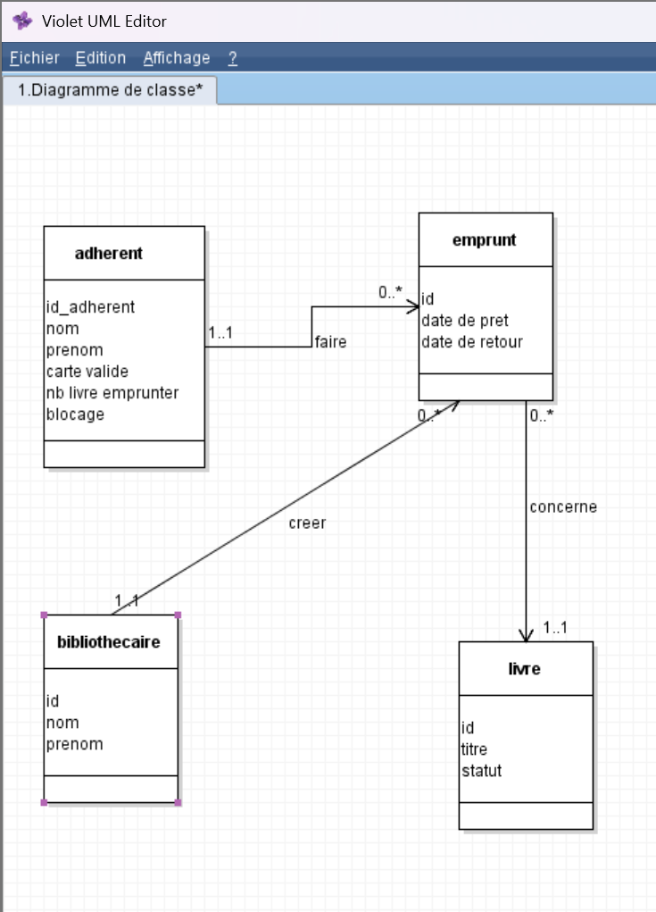

#### Diagramme de sequence

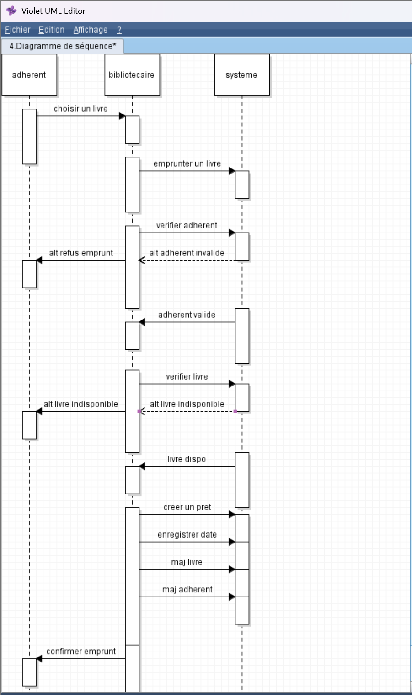

### Resultat attendu

Le travail doit contenir :

- un diagramme de cas d'utilisation ;
- un diagramme de classes ;
- un diagramme de sequence.

Les diagrammes doivent etre :

- lisibles ;
- coherents ;
- conformes a la notation UML.

---

## Exercice 9 - Gestion de trajet

### Objectif

Modeliser un systeme automatique de reservation de billets de train a partir d'une billetterie automatique.

### Scenario principal - Reserver un trajet

Un utilisateur se presente devant une billetterie automatique.

Il peut rechercher des trajets en indiquant :

- le lieu de depart ;
- le lieu d'arrivee ;
- une heure approximative de depart.

Le systeme recherche alors les trajets possibles.

Chaque trajet propose peut etre compose d'un ou de plusieurs trains.

Le systeme ne propose que les trajets pour lesquels tous les trains disposent encore de places disponibles.

Les trajets contenant au moins un train complet sont automatiquement elimines.

L'utilisateur peut ensuite choisir un trajet propose et reserver une place sur l'ensemble des trains constituant ce trajet.

### Travail demande

#### Diagramme de cas d'utilisation

Le diagramme doit faire apparaitre :

- l'acteur principal ;
- le systeme de billetterie automatique ;
- le cas d'utilisation principal "Reserver un trajet".

Il peut egalement faire apparaitre les cas d'utilisation suivants :

- saisir les criteres de recherche ;
- rechercher les trajets disponibles ;
- consulter les trajets proposes ;
- choisir un trajet ;
- verifier les places disponibles ;
- reserver les billets.

> Penser a utiliser la relation `include` lorsque certaines actions sont obligatoires dans le deroulement du cas d'utilisation.

#### Diagramme de classes

Le diagramme doit representer les principales classes du systeme.

Classes possibles :

**Utilisateur**

- `idUtilisateur` ;
- `nom`.

**BilletterieAutomatique**

- `idBorne` ;
- `localisation`.

**Gare**

- `idGare` ;
- `nom` ;
- `ville`.

**Train**

- `numeroTrain` ;
- `heureDepart` ;
- `heureArrivee` ;
- `nombrePlacesDisponibles`.

**Trajet**

- `idTrajet` ;
- `lieuDepart` ;
- `lieuArrivee` ;
- `heureDepartApproximative`.

**Reservation**

- `idReservation` ;
- `dateReservation` ;
- `statut`.

Un trajet peut etre compose d'un ou plusieurs trains.

Une reservation concerne un utilisateur et un trajet choisi.

Ajouter les associations entre les classes ainsi que les multiplicites.

Exemples de multiplicites possibles :

- un `Utilisateur` peut effectuer plusieurs `Reservation` ;
- une `Reservation` concerne un seul `Trajet` ;
- un `Trajet` est compose d'un ou plusieurs `Train` ;
- un `Train` peut appartenir a plusieurs trajets proposes.

#### Diagramme de sequence

Le diagramme de sequence doit representer le scenario "Reserver un trajet".

Il doit faire apparaitre au minimum :

- l'utilisateur ;
- la billetterie automatique ;
- le systeme de reservation ;
- les trajets proposes ;
- les trains ;
- la reservation.

Le diagramme doit montrer les etapes suivantes :

1. L'utilisateur saisit le lieu de depart, le lieu d'arrivee et l'heure approximative de depart.
2. La billetterie transmet les criteres au systeme de reservation.
3. Le systeme recherche les trajets correspondant a la demande.
4. Pour chaque trajet trouve, le systeme verifie que tous les trains disposent de places disponibles.
5. Les trajets contenant un train complet sont elimines.
6. Le systeme affiche uniquement les trajets disponibles.
7. L'utilisateur choisit un trajet.
8. Le systeme cree une reservation pour tous les trains du trajet choisi.
9. Le nombre de places disponibles est mis a jour pour chaque train.
10. Le systeme confirme la reservation.

Utiliser :

- une boucle `loop` pour representer la verification des trains de chaque trajet ;
- un bloc conditionnel `alt` pour distinguer :
  - trajet disponible ;
  - trajet refuse car au moins un train est complet ;
  - reservation confirmee.

### Diagrammes

#### Diagramme de cas d'utilisation

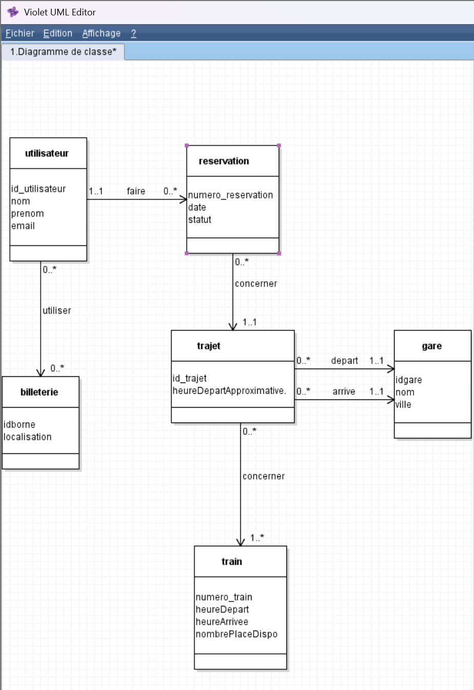

#### Diagramme de classes

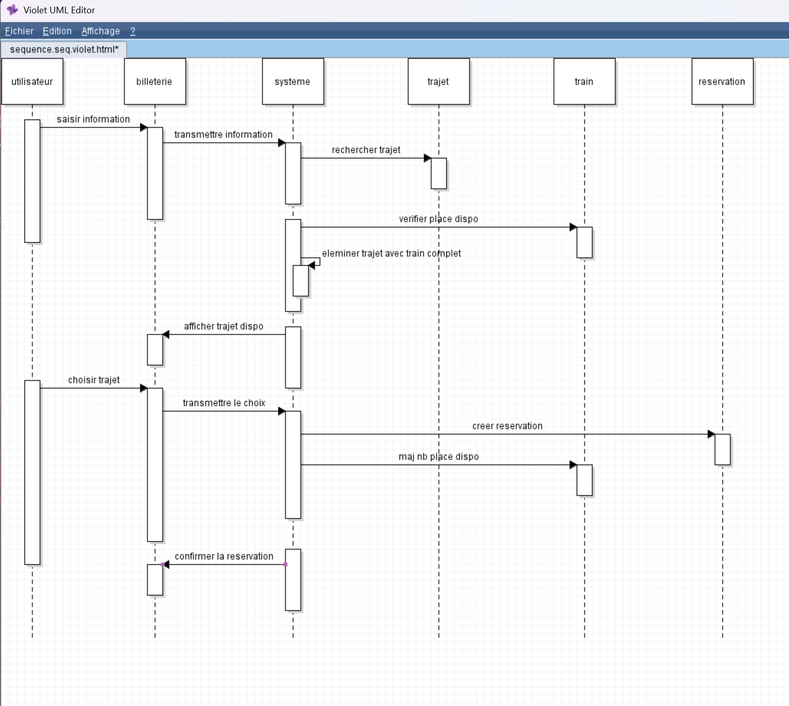

#### Diagramme de sequence

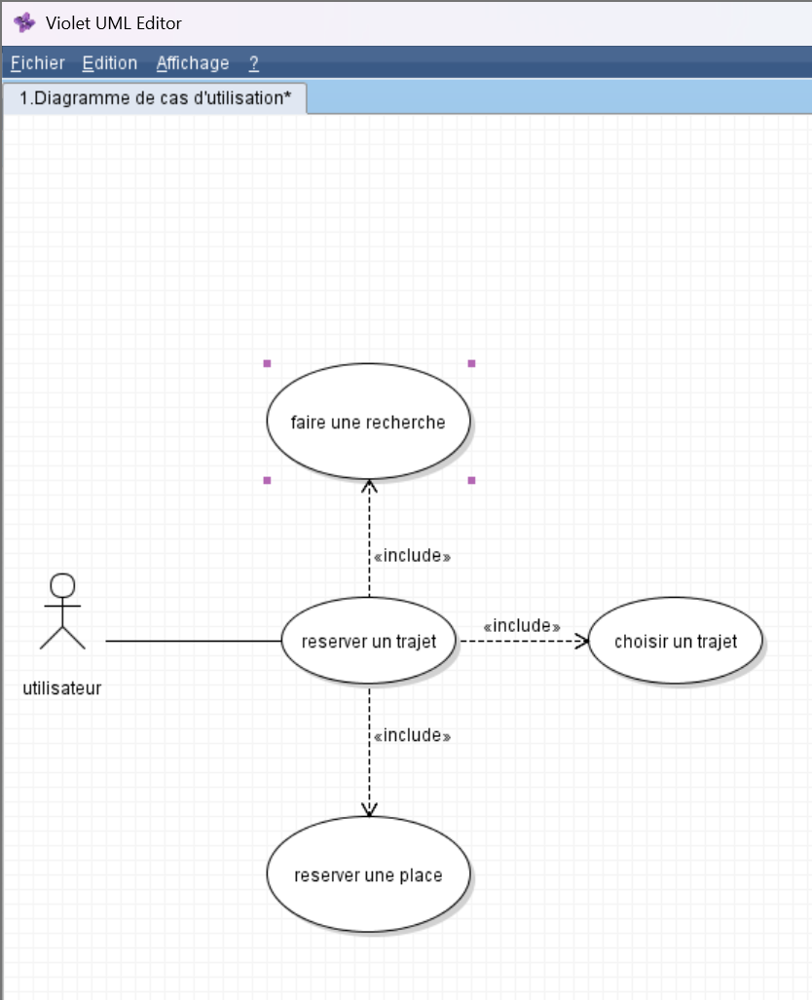

### Resultat attendu

Le travail doit contenir :

- un diagramme de cas d'utilisation ;
- un diagramme de classes ;
- un diagramme de sequence correspondant au scenario decrit.

Les diagrammes doivent etre :

- clairs ;
- coherents ;
- conformes a la notation UML.

---

## Exercice 10 - Gestion d'un entrepot de stockage

### Objectif

Modeliser un systeme informatique permettant de faciliter la gestion d'un entrepot de stockage.

### Contexte

Le logiciel doit permettre d'attribuer automatiquement un emplacement de stockage aux articles decharges des camions.

Il doit egalement permettre de liberer les emplacements lorsque des articles sont charges dans un camion.

Le chargement et le dechargement physiques des camions sont realises manuellement par les employes.

Les employes sont places sous la responsabilite d'un chef d'entrepot, qui supervise la bonne application des consignes.

### Scenario 1 - Dechargement d'un camion

Lorsqu'un camion arrive a l'entrepot, un employe saisit dans le systeme les caracteristiques de chaque article a entreposer.

Pour chaque article, le systeme doit :

- enregistrer les caracteristiques de l'article ;
- rechercher un emplacement disponible ;
- attribuer automatiquement un emplacement a l'article ;
- marquer l'emplacement comme occupe ;
- produire une liste indiquant l'emplacement attribue a chaque article.

### Scenario 2 - Chargement d'un camion

Lorsqu'un camion doit etre charge, un employe saisit dans le systeme les caracteristiques des articles a charger.

Pour chaque article, le systeme doit :

- rechercher l'article dans le stock ;
- identifier son emplacement actuel ;
- liberer l'emplacement correspondant ;
- mettre a jour l'etat du stock ;
- produire une confirmation de liberation des emplacements.

### Travail demande

#### Diagramme de cas d'utilisation

Le diagramme doit faire apparaitre :

- les acteurs du systeme ;
- les cas d'utilisation principaux ;
- les relations eventuelles entre les cas d'utilisation.

Acteurs possibles :

- employe ;
- chef d'entrepot.

Cas d'utilisation possibles :

- decharger un camion ;
- charger un camion ;
- saisir les caracteristiques des articles ;
- attribuer un emplacement ;
- liberer un emplacement ;
- consulter la liste des emplacements ;
- superviser les operations.

Utiliser la relation `include` pour les actions obligatoires comme :

- saisir les caracteristiques des articles ;
- attribuer un emplacement ;
- liberer un emplacement ;
- mettre a jour le stock.

#### Diagramme de classes

Le diagramme doit representer les principales classes du systeme.

Classes possibles :

**Employe**

- `idEmploye` ;
- `nom` ;
- `prenom`.

**ChefEntrepot**

- `idChef` ;
- `nom` ;
- `prenom`.

**Camion**

- `immatriculation` ;
- `typeOperation`.

**Article**

- `idArticle` ;
- `designation` ;
- `poids` ;
- `volume` ;
- `reference`.

**Emplacement**

- `idEmplacement` ;
- `zone` ;
- `capaciteMax` ;
- `disponible`.

**OperationStock**

- `idOperation` ;
- `typeOperation` ;
- `dateOperation`.

Il est possible de prevoir deux types d'operations :

- `Dechargement` ;
- `Chargement`.

Associations possibles :

- un `Employe` realise plusieurs `OperationStock` ;
- un `ChefEntrepot` supervise plusieurs `Employe` ;
- une `OperationStock` concerne un `Camion` ;
- une `OperationStock` concerne un ou plusieurs `Article` ;
- un `Article` est stocke dans un `Emplacement` ;
- un `Emplacement` peut contenir zero, un ou plusieurs articles selon sa capacite.

Ajouter les multiplicites sur les associations.

#### Diagramme de sequence

Le diagramme de sequence doit representer au choix :

- le scenario "Decharger un camion" ;
- ou le scenario "Charger un camion".

Il est aussi possible de realiser deux diagrammes de sequence pour representer les deux scenarios.

**Diagramme de sequence - Decharger un camion**

Le diagramme doit faire apparaitre :

- l'employe ;
- le systeme de gestion de l'entrepot ;
- le camion ;
- les articles ;
- les emplacements ;
- la liste des emplacements attribues.

Etapes attendues :

1. L'employe lance l'operation de dechargement.
2. Il saisit les caracteristiques de chaque article.
3. Le systeme enregistre les articles.
4. Pour chaque article, le systeme recherche un emplacement disponible.
5. Le systeme attribue un emplacement a l'article.
6. Le systeme marque l'emplacement comme occupe.
7. Le systeme genere la liste des articles avec leurs emplacements.
8. L'employe consulte la liste pour realiser le dechargement manuel.

Utiliser une boucle `loop` pour representer le traitement de chaque article.

**Diagramme de sequence - Charger un camion**

Le diagramme doit faire apparaitre :

- l'employe ;
- le systeme de gestion de l'entrepot ;
- les articles ;
- les emplacements ;
- le camion.

Etapes attendues :

1. L'employe lance l'operation de chargement.
2. Il saisit les caracteristiques des articles a charger.
3. Le systeme recherche les articles dans le stock.
4. Le systeme identifie les emplacements correspondants.
5. Pour chaque article, le systeme libere l'emplacement.
6. Le systeme met a jour le stock.
7. Le systeme confirme la liberation des emplacements.
8. L'employe realise le chargement manuel du camion.

Utiliser une boucle `loop` pour representer le traitement de chaque article.

### Diagrammes

#### Diagramme de cas d'utilisation

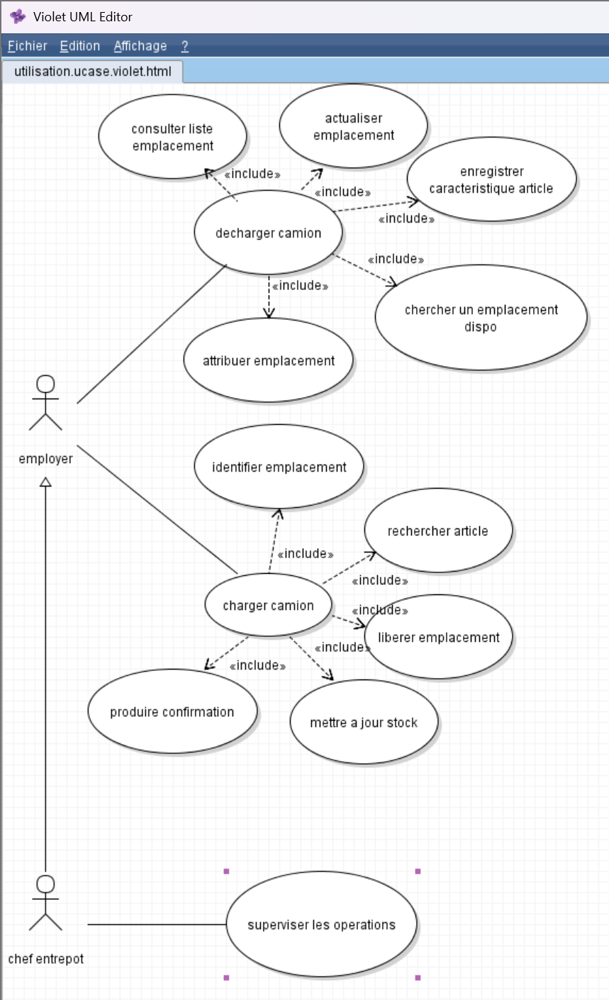

#### Diagramme de classes

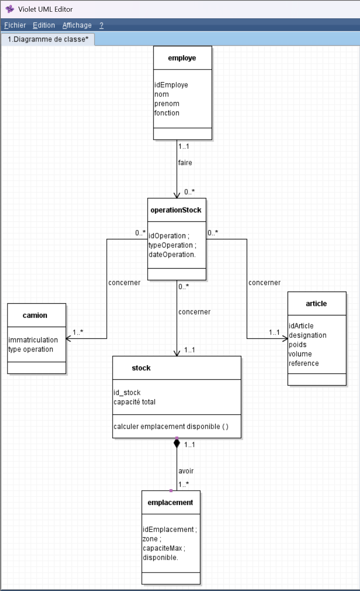

#### Diagramme de sequence

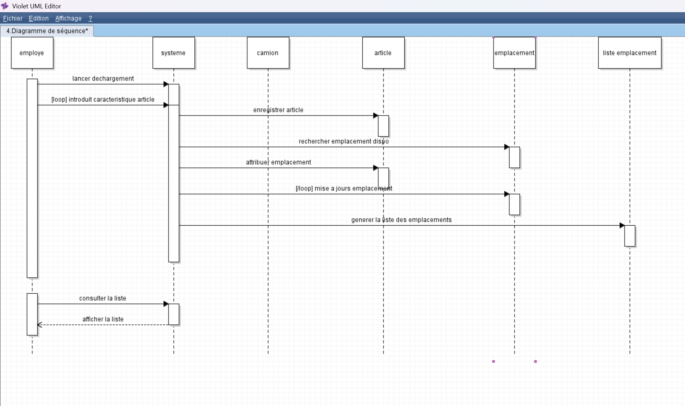

### Resultat attendu

Le travail doit contenir :

- un diagramme de cas d'utilisation ;
- un diagramme de classes ;
- un diagramme de sequence pour le dechargement ou le chargement d'un camion.

Les diagrammes doivent etre :

- lisibles ;
- coherents ;
- conformes a la notation UML.

---

## Exercice 11 - Retrait au distributeur automatique de billets

### Enonce

Le deroulement normal d'utilisation d'un distributeur automatique de billets est le suivant :

1. Le client introduit sa carte bancaire.
2. La machine verifie la validite de la carte et demande le code au client.
3. Si le code est correct, la machine envoie une demande d'autorisation de prelevement au groupement de banques.
4. Le groupement de banques renvoie le solde autorise a prelever.
5. Le distributeur propose alors plusieurs montants a prelever.
6. Le client saisit le montant a retirer.
7. Apres controle du montant par rapport au solde autorise, le distributeur demande au client s'il desire un ticket.
8. Apres la reponse du client, la carte est ejectee et recuperee par le client.
9. Les billets sont alors delivres, ainsi que le ticket si le client l'a demande.
10. Le client recupere enfin les billets et son ticket.

### Travail a faire

Modeliser cette situation a l'aide d'un diagramme de sequence en ne prenant en compte que le cas ou tout se passe bien.

### Diagramme

#### Diagramme de sequence

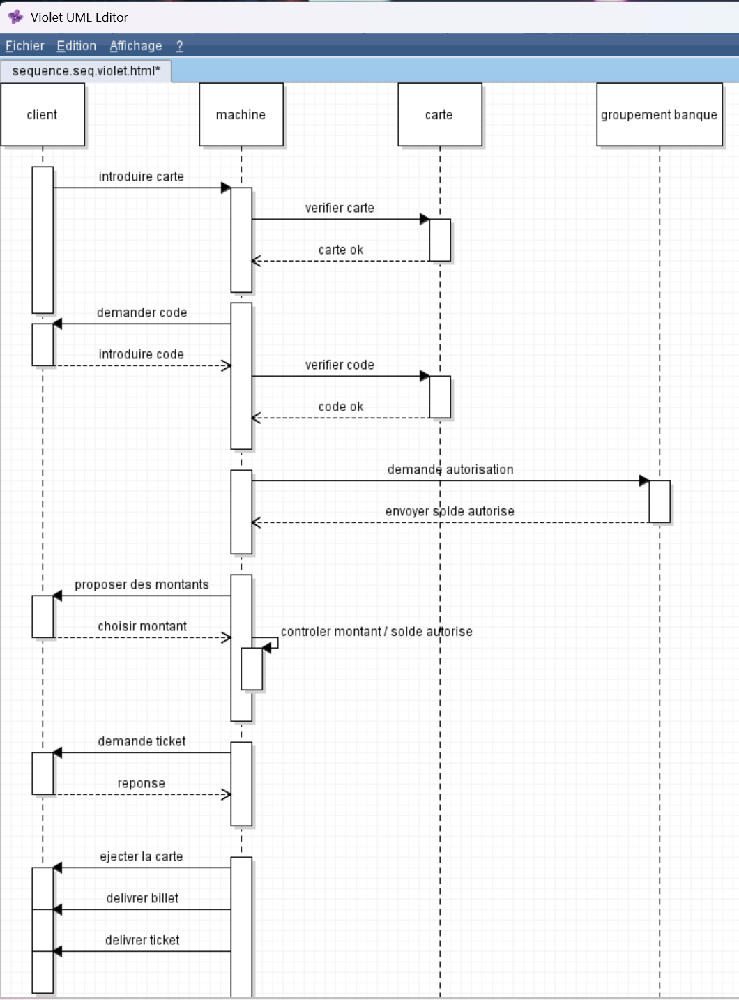

---

## Exercice 12 - Magasin de vente de fleurs

### Enonce

On souhaite gerer les differents objets qui concourent a l'activite d'un magasin de vente de fleurs.

Le deroulement est le suivant :

1. Le client demande au vendeur des renseignements sur les compositions florales.
2. Le vendeur lui fournit toutes les informations necessaires.
3. Le client commande la composition de son choix.
4. Le vendeur emet le bon de fabrication.
5. Le vendeur transmet le bon de fabrication a son ouvrier fleuriste.
6. Le vendeur edite ensuite la facture correspondante.
7. L'ouvrier fleuriste cree la composition.
8. L'ouvrier fleuriste archive le bon de fabrication.
9. L'ouvrier fleuriste remet la composition au vendeur.
10. La facture est remise au client pour reglement une fois le bouquet realise.
11. Une fois la facture reglee, le client recupere sa composition et quitte le magasin.

### Travail a faire

Modeliser cette situation a l'aide d'un diagramme de sequence.

### Diagramme

#### Diagramme de sequence

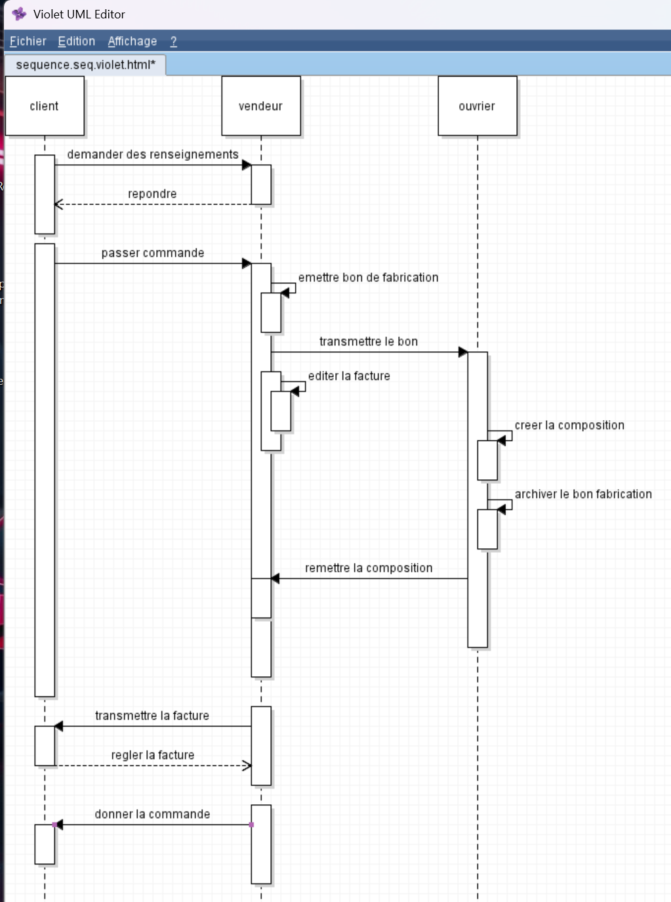

---

## Exercice 13 - Caisse de supermarche

### Enonce

Le deroulement normal d'utilisation d'une caisse de supermarche est le suivant :

1. Un client arrive a la caisse avec ses articles a payer.
2. Le caissier enregistre le numero d'identification de chaque article, ainsi que la quantite si elle est superieure a 1.
3. La caisse affiche le prix de chaque article et son libelle.
4. Lorsque tous les achats sont enregistres, le caissier signale la fin de la vente.
5. La caisse affiche le total des achats.
6. Le caissier annonce au client le montant total a payer.
7. Le client choisit son mode de paiement.

Modes de paiement possibles :

- liquide : le caissier encaisse l'argent et la caisse indique le montant a rendre au client ;
- cheque : le caissier note le numero de piece d'identite du client ;
- carte de credit : la demande d'autorisation est envoyee avant la saisie.

Suite du deroulement :

8. La caisse enregistre la vente et l'imprime.
9. Le caissier donne le ticket de caisse au client.

### Travail a faire

Modeliser cette situation a l'aide d'un diagramme de sequence en ne prenant en compte que le cas du paiement en liquide.

### Diagramme

#### Diagramme de sequence

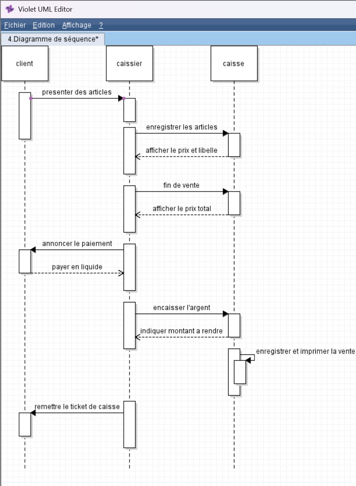

---

## Exercice 14 - Gestion d'une agence de location immobiliere

### Contexte

Une agence de location de maisons et d'appartements desire gerer sa liste de logements.

Elle souhaite developper un logiciel de gestion immobiliere pour gerer les informations suivantes :

- les logements, comme les maisons et les appartements de type studio, T1, T2, etc. ;
- les personnes occupant ces logements, c'est-a-dire les signataires des contrats de location uniquement ;
- les contrats de location.

Les caracteristiques des logements comprennent :

- l'adresse ;
- la superficie ;
- le loyer ;
- le type de logement : maison, studio, T1, T2, etc.

Pour chaque type de logement, l'agence facture toujours une somme forfaitaire additionnelle au loyer.

Par exemple, le prix d'un studio sera toujours egal au prix du loyer plus 30 euros de charges forfaitaires par mois.

Les informations concernant les individus qui occupent les logements incluent :

- le nom ;
- le prenom ;
- la date de naissance ;
- le numero de telephone.

L'agence souhaite egalement gerer l'historique des locations.

Chaque contrat de location comprend :

- une date de debut ;
- une date de fin.

Un individu peut etre signataire de plusieurs contrats de location.

Un logement peut etre loue plusieurs fois de maniere disjointe dans le temps.

### Travail demande

Modeliser cette application en utilisant le diagramme UML suivant :

- diagramme de cas d'utilisation : identifier les acteurs et les cas d'utilisation principaux de l'application.

### Diagramme

#### Diagramme de cas d'utilisation

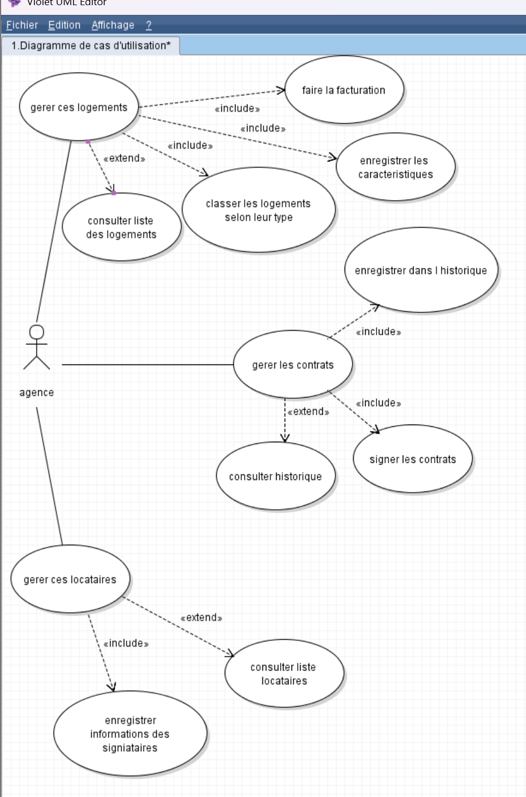

